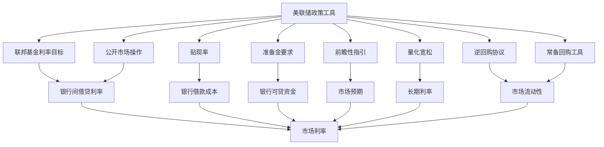

```mermaid
graph TD
    A[美联储政策工具]
    A --> B[联邦基金利率目标]
    A --> C[公开市场操作]
    A --> D[贴现率]
    A --> E[准备金要求]
    A --> F[前瞻性指引]
    A --> G[量化宽松]
    A --> H[逆回购协议]
    A --> I[常备回购工具]

    B --> J[银行间借贷利率]
    C --> J
    D --> K[银行借款成本]
    E --> L[银行可贷资金]
    F --> M[市场预期]
    G --> N[长期利率]
    H --> O[市场流动性]
    I --> O

    J --> P[市场利率]
    K --> P
    L --> P
    M --> P
    N --> P
    O --> P
```