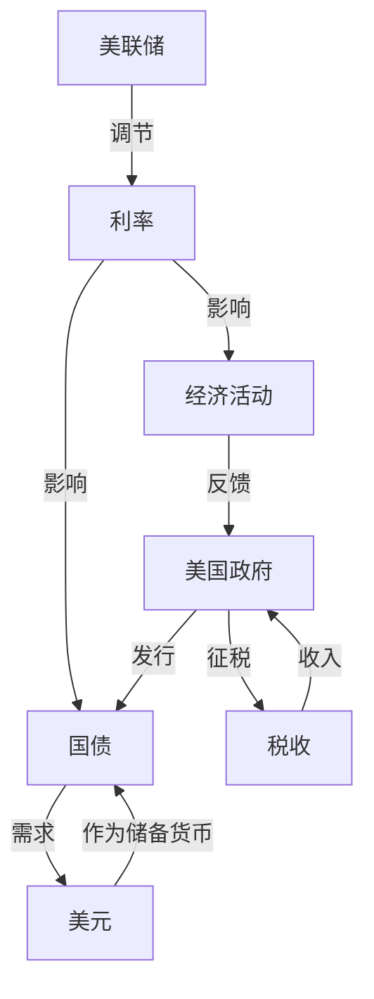

```mermaid
graph TB
    A[美国政府] -->|发行| B[国债]
    A -->|征税| C[税收]
    B -->|需求| D[美元]
    D -->|作为储备货币| B
    E[美联储] -->|调节| F[利率]
    F -->|影响| B
    F -->|影响| G[经济活动]
    C -->|收入| A
    G -->|反馈| A
```