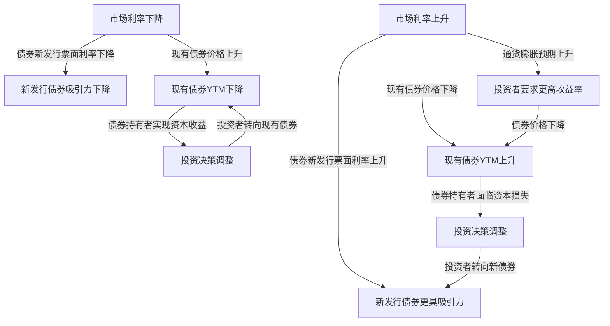

```mermaid
graph TD
    A[市场利率上升] -->|债券新发行票面利率上升| B[新发行债券更具吸引力]
    A -->|现有债券价格下降| C[现有债券YTM上升]
    C -->|债券持有者面临资本损失| D[投资决策调整]
    D -->|投资者转向新债券| B
    A -->|通货膨胀预期上升| E[投资者要求更高收益率]
    E -->|债券价格下降| C
    F[市场利率下降] -->|债券新发行票面利率下降| G[新发行债券吸引力下降]
    F -->|现有债券价格上升| H[现有债券YTM下降]
    H -->|债券持有者实现资本收益| I[投资决策调整]
    I -->|投资者转向现有债券| H
```