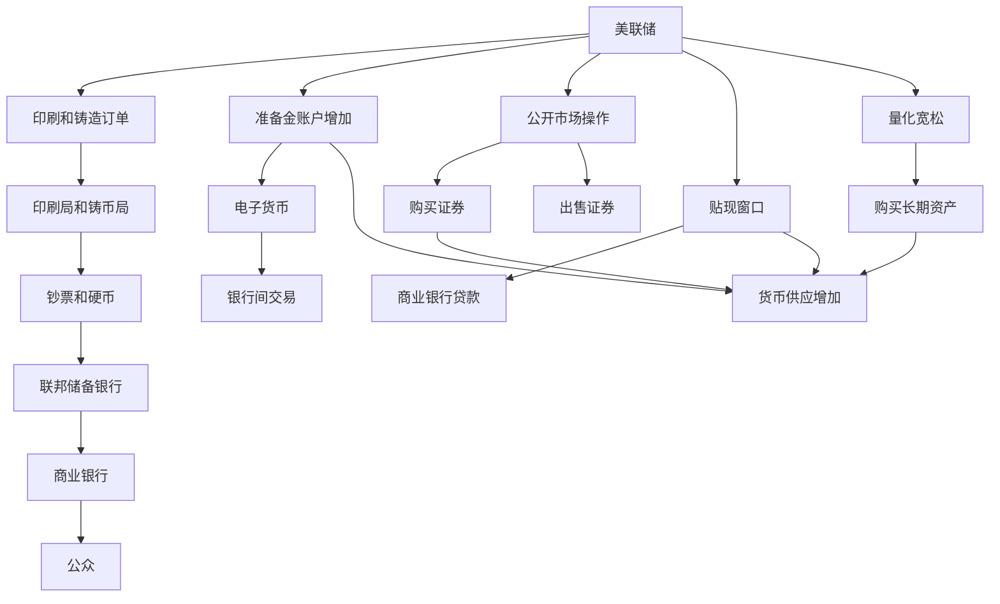

```mermaid
graph TD
    A[美联储]
    A --> B[印刷和铸造订单]
    B --> C[印刷局和铸币局]
    C --> D[钞票和硬币]
    D --> E[联邦储备银行]
    E --> F[商业银行]
    F --> G[公众]

    A --> H[准备金账户增加]
    H --> I[电子货币]
    I --> J[银行间交易]

    A --> K[公开市场操作]
    K --> L[购买证券]
    K --> M[出售证券]

    A --> N[贴现窗口]
    N --> O[商业银行贷款]

    A --> P[量化宽松]
    P --> Q[购买长期资产]

    Q --> R[货币供应增加]
    L --> R
    H --> R
    N --> R
```