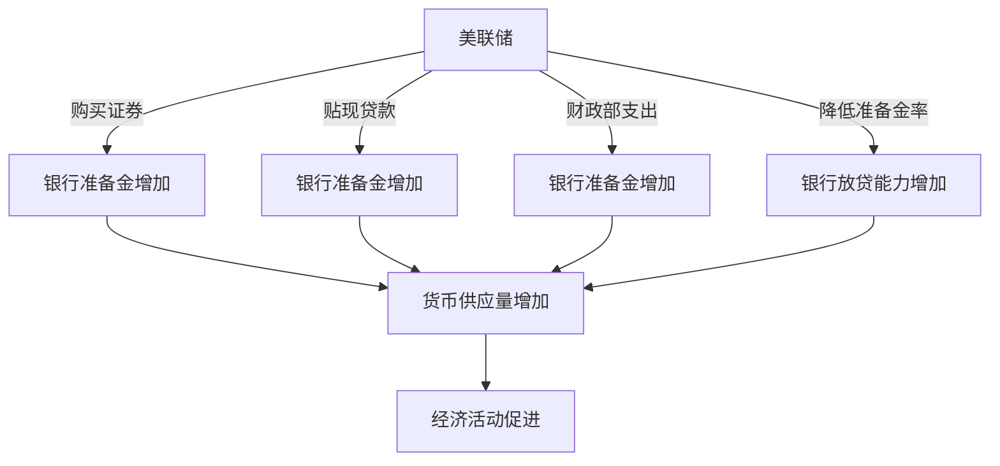

```mermaid
graph TD
    A[美联储]
    A -->|购买证券| B[银行准备金增加]
    A -->|贴现贷款| C[银行准备金增加]
    A -->|财政部支出| D[银行准备金增加]
    A -->|降低准备金率| E[银行放贷能力增加]

    B --> F[货币供应量增加]
    C --> F
    D --> F
    E --> F
    F --> G[经济活动促进]
```