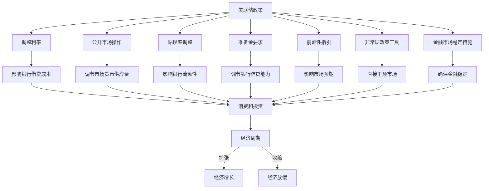

```mermaid
graph TD
    A[美联储政策] --> B[调整利率]
    A --> C[公开市场操作]
    A --> D[贴现率调整]
    A --> E[准备金要求]
    A --> F[前瞻性指引]
    A --> G[非常规政策工具]
    A --> H[金融市场稳定措施]
    
    B --> I[影响银行借贷成本]
    C --> J[调节市场货币供应量]
    D --> K[影响银行流动性]
    E --> L[调节银行信贷能力]
    F --> M[影响市场预期]
    G --> N[直接干预市场]
    H --> O[确保金融稳定]
    
    I --> P[消费和投资]
    J --> P
    K --> P
    L --> P
    M --> P
    N --> P
    O --> P
    
    P --> Q[经济周期]
    Q --> |扩张| R[经济增长]
    Q --> |收缩| S[经济放缓]
```