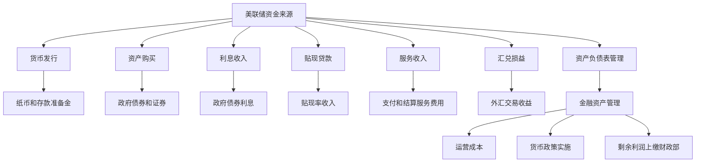

```mermaid
graph TD
    A[美联储资金来源]
    A --> B[货币发行]
    A --> C[资产购买]
    A --> D[利息收入]
    A --> E[贴现贷款]
    A --> F[服务收入]
    A --> G[汇兑损益]
    A --> H[资产负债表管理]

    B --> I[纸币和存款准备金]
    C --> J[政府债券和证券]
    D --> K[政府债券利息]
    E --> L[贴现率收入]
    F --> M[支付和结算服务费用]
    G --> N[外汇交易收益]
    H --> O[金融资产管理]

    O --> P[运营成本]
    O --> Q[货币政策实施]
    O --> R[剩余利润上缴财政部]
```